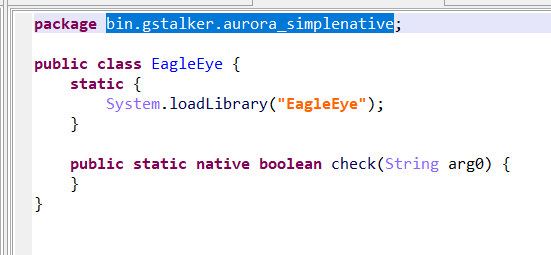
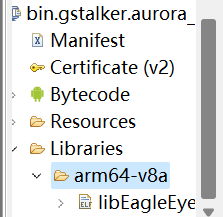
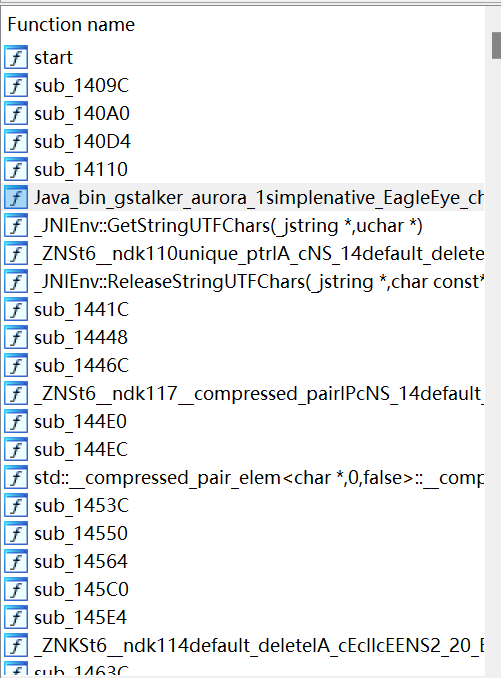
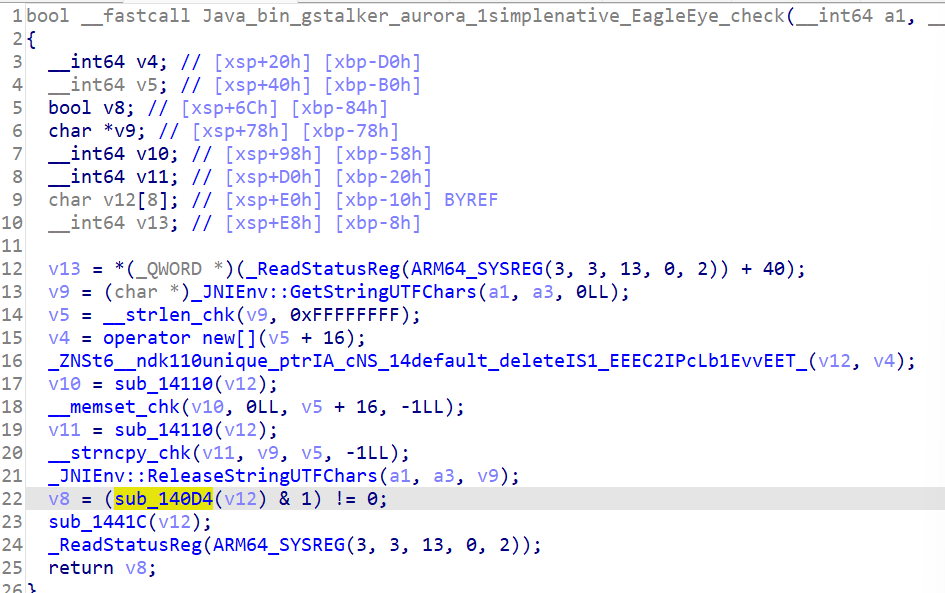
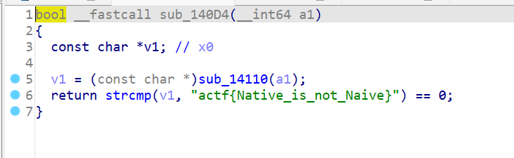

# AuroraBasicNative	

有关apk的基础知识，基本逆向方法去看AuroraBasicAndroid的wp。这里不再重复叙述

和上一题相比，这一题唯一的不同点是把check函数做成了一个native函数

native函数说白了就是在java里头跑c/cpp/rust/go编译出来的直接用cpu跑而不是AndroidRuntime虚拟机跑的代码

注意bin.gstalker.aurora_simplenative.EagleEye

System.loadLibrary说明这个类加载了一个Native的动态链接库

通常情况下，apk的动态链接库存放在Libraries文件夹下

我们把这个动态链接库提取出来，用ida分析

通常情况下，native函数的符号十分的显眼

下面这张图相信我不说大家也能看出来哪个是关联到java层的native函数

由于函数使用CPP编程，其中stl展开以后会生成很多wrapper函数，比较难看。这时候我们可以选择不关注哪些乱起八糟的玩意，先从返回值看起

返回值为v8,v8取决于v12和sub_140D4函数，v12则来自于从Java.lang.String形式的参数中去取出的字符串

再一看sub_140D4里头有啥

那逻辑很清楚了，就是简单的把输入做了个字符串比较。

FIN