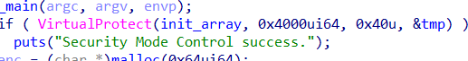
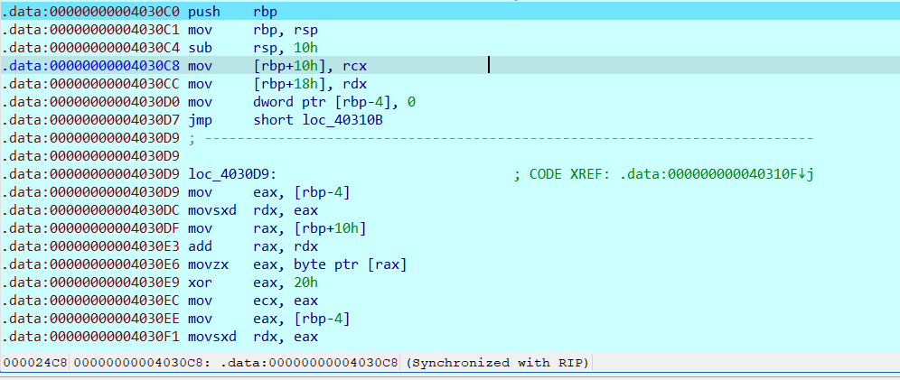
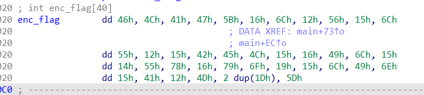

# SMC WriteUp

考察点：自修改代码

看到调用VirtualProtect函数修改了内存页的读写执行权限，猜测是SMC

看到对init_array进行异或后将其强转换为函数指针猜测init_array函数内容就是以后要执行的代码。

动态调试进入解码后的init_array里。F7进入函数。

阅读汇编代码，看到xor eax, 20h 猜测是异或运算。

对enc_flag的内容进行异或，得到flag

flag{6L2v5Lu25bel56iL54uX6YO95LiN5a2m==}
