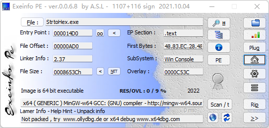
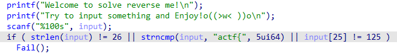
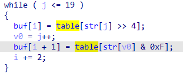
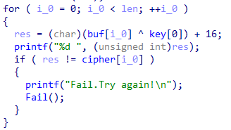
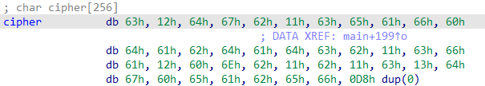
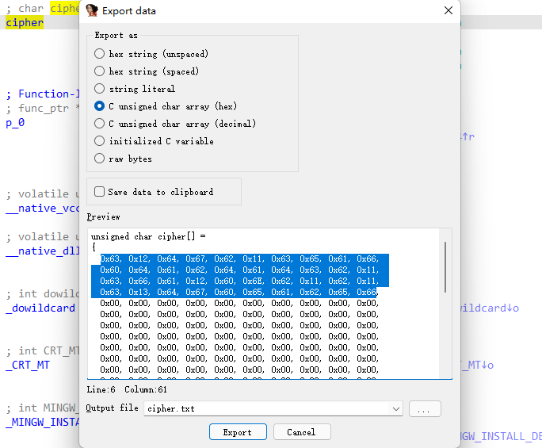

# StrtoHex

## 1.查壳



无壳

## 2.静态分析

选择main函数，按F5反编译，如下图可知，flag长度为26位，格式为actf{xxxx}



此处完成了对输入的十六进制转换并输出转换成十六进制的字符串



将字符串逐字符异或加密



并将加密结果与cipher数组对比，完全一致即成功



选中cipher，按shift+e导出数据



这样就可以直接复制cipher数组中的数据而不需要手动在exp中输入

## 3.exp

```python
import binascii

cipher = [0x63, 0x12, 0x64, 0x67, 0x62, 0x11, 0x63, 0x65, 0x61, 0x66,
          0x60, 0x64, 0x61, 0x62, 0x64, 0x61, 0x64, 0x63, 0x62, 0x11,
          0x63, 0x66, 0x61, 0x12, 0x60, 0x6E, 0x62, 0x11, 0x62, 0x11,
          0x63, 0x13, 0x64, 0x67, 0x60, 0x65, 0x61, 0x62, 0x65, 0x66]
xor_bytes = []
for i in cipher:
    i = (i - 16) ^ ord('g')
    xor_bytes.append(i)
print(xor_bytes)

hexstring = ''
for i in xor_bytes:
    hexstring += chr(i)

print('actf{' + binascii.unhexlify(hexstring).decode("utf-8") + '}')
```

## 4.flag

```
actf{N0_Base64_Any__M0re!}
```
