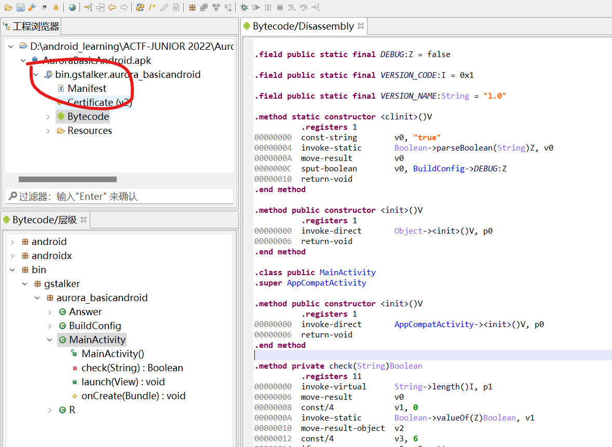
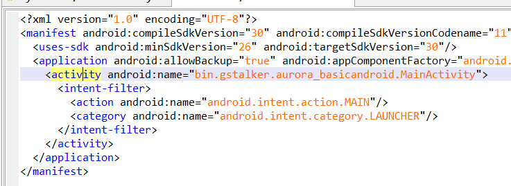

# Aurora_Basic_Android

基础安卓逆向

安卓安装包为apk格式，其中包含：

1. dex文件，该文件为delvik虚拟机代码（android runtime代码）
2. 签名信息
3. android_manifest.xml，该文件说明了apk的基本程序信息
4. assets: 程序用到的资源文件，如图片，mp4，原生动态链接库（在Native那题会提到）等。如果程序开发者比较规范，apk所使用的字符串也会以xml的形式放在该目录下。

对于初学者来说，推荐使用JEB对apk安装包进行解析。当然android studio也自带apk分析器，有兴趣的同学也可以自行尝试

## 一、找到程序入口Activity

使用jeb解析题目提供的apk，首先先看AndroidManifest.xml(在右上角)



我们可以注意到有一个名字为`bin.gstalker.aurora_basicandroid.MainActivity`的Activity，并且其带有一个intent接收器，指定接受类型为`android.intent.category.LAUNCHER`的intent

事实上，我们从手机的菜单页面点击某个app图标，就相当于向这个app发送了一个`android.intent.category.LAUNCHER`的Intent，Intent-daemon在接到该类型的Intent后会通知Zygote启动该app

对于没有安卓开发基础的同学，我们抽象以下上面这一大堆话：

在AndroidManifest.xml中带有`android.intent.category.LAUNCHER`字样的Activity就**是程序的入口点**，等同于默认情况下C/CPP的`int main()`



## 二、分析检验程序

从Manifset中我们还可以得知，该apk只有一个Activity。所以我们打开程序的时候的页面就是我们上一节中提到`bin.gstalker.aurora_basicandroid.MainActivity`

程序页面只有一个文本输入窗口和一个按钮，很明显的，只要知道我们按下按钮后程序执行了什么校验逻辑，那就能逆向出程序所需要的输入。

在Resource/layout文件夹下可以看到activiti_main.xml文件夹，该文件为按钮指定了按钮按下时的callback函数

（我估计有些同学可能找不到,原文直接搬运到这里）

注意Button标签的属性`android:onClick="launch" `，launch就是按钮被按下后会执行的函数

```xml
<?xml version="1.0" encoding="UTF-8"?>
<android.support.constraint.ConstraintLayout android:id="@id/MainActivity" android:layout_height="-1" android:layout_width="-1" xmlns:android="http://schemas.android.com/apk/res/android" xmlns:app="http://schemas.android.com/apk/res-auto">
  <EditText android:ems="10" android:id="@id/flagReceiver" android:importantForAutofill="0x2" android:inputType="0x61" android:layout_height="-2" android:layout_marginBottom="165.0dp" android:layout_marginEnd="32.0dp" android:layout_marginStart="32.0dp" android:layout_marginTop="24.0dp" android:layout_width="-2" android:text="@string/inputyourflaghere" app:layout_constraintBottom_toTopOf="@id/nuclearBriefcase" app:layout_constraintEnd_toEndOf="0" app:layout_constraintHorizontal_bias="0.496" app:layout_constraintStart_toStartOf="0" app:layout_constraintTop_toBottomOf="@id/resultTextView"/>
  <Button android:id="@id/nuclearBriefcase" android:layout_height="-2" android:layout_marginBottom="120.0dp" android:layout_marginEnd="162.0dp" android:layout_marginStart="162.0dp" android:layout_width="-2" android:onClick="launch" android:text="@string/check" app:layout_constraintBottom_toBottomOf="0" app:layout_constraintEnd_toEndOf="0" app:layout_constraintHorizontal_bias="1.0" app:layout_constraintStart_toStartOf="0"/>
  <ImageView android:contentDescription="@string/just_a_icon" android:id="@id/imageView" android:layout_height="-2" android:layout_marginBottom="16.0dp" android:layout_marginEnd="105.0dp" android:layout_marginStart="104.0dp" android:layout_marginTop="102.0dp" android:layout_width="-2" app:layout_constraintBottom_toTopOf="@id/resultTextView" app:layout_constraintEnd_toEndOf="0" app:layout_constraintHorizontal_bias="0.0" app:layout_constraintStart_toStartOf="0" app:layout_constraintTop_toTopOf="0" app:srcCompat="@drawable/aurora_icon"/>
  <TextView android:gravity="0x11" android:id="@id/resultTextView" android:layout_height="22.0dp" android:layout_marginBottom="8.0dp" android:layout_marginEnd="122.0dp" android:layout_marginStart="121.0dp" android:layout_marginTop="68.0dp" android:layout_width="168.0dp" android:visibility="0" app:layout_constraintBottom_toTopOf="@id/flagReceiver" app:layout_constraintEnd_toEndOf="0" app:layout_constraintStart_toStartOf="0" app:layout_constraintTop_toBottomOf="@id/imageView"/>
</android.support.constraint.ConstraintLayout>
```

接着看函数`public void bin.gstalker.aurora_basicandroid.MainActivity.launch(View arg6)`

函数逻辑十分简单：从文本输入框中获取用户的输入，并通过check()检查该输入是否为预期输入

再看check()

check的逻辑为：

1. 检查输入的首部和结束部分是否分别为`actf{`和`}`
2. 取中间部分的每一个字符，直接转化为十进制数据后和Answer数组中的数据进行比较

那么看Answer中的数据是啥

```Java
package bin.gstalker.aurora_basicandroid;

public class Answer {
    public static final int[] vec;

    static {
        Answer.vec = new int[]{7, 3, 5, 5, 6, 0, 8};
    }
}

```

所以flag为`actf{7355608}`